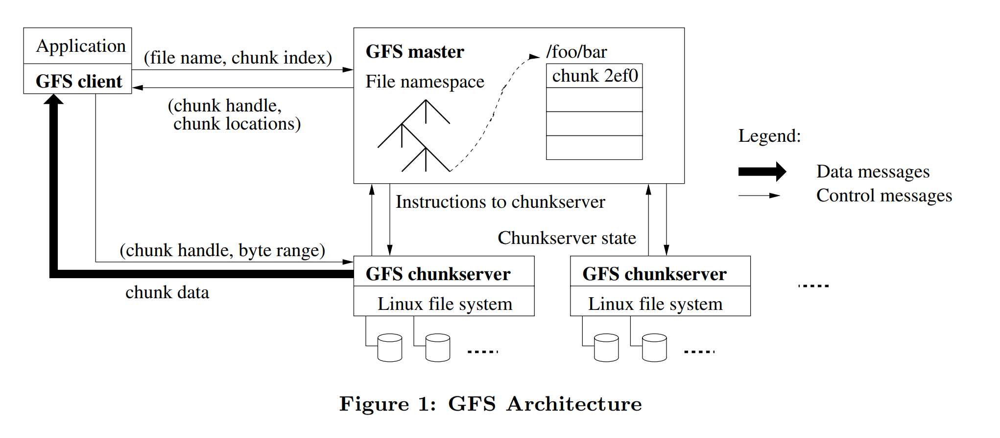
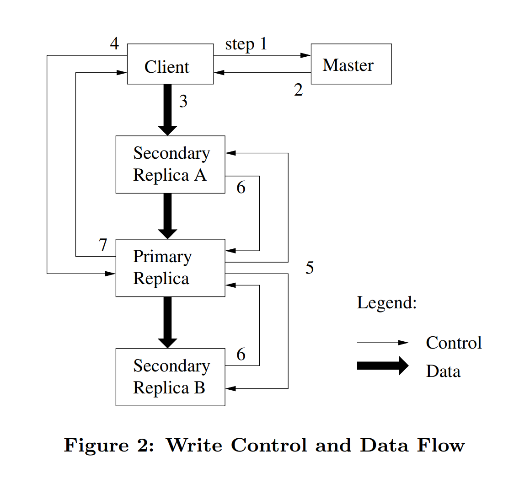

# 1.GFS是什么

GFS全称是The Google File System，一个面向大规模数据密集型应用的、可伸缩的分布式文件系统。GFS虽然运行在廉价的普遍硬件设备上，但是它依然了提供灾难冗余的能力，为大量客户机提供了高性能的服务。 

它通过**容错机制**和**负载均衡**解决了**海量的超大文件的分布式存储问题**。

# 2.GFS面临的问题

在设计GFS的时候主要考虑了应用场景的以下特性：

- 故障时常发生
- 文件十分巨大
- 大部分文件修改操作只是追加而不是覆盖
- 协同设计文件系统和应用可以增加系统的灵活性

# 3.概要设计

## 3.1设计预期

- 系统能够监控自身状态，如果组件失效，能够迅速地侦测、冗余并恢复失效的组件
- 系统存储一定数量的大文件，通常为100MB及以上，数GB的大小也常见，系统能够存储小文件，但是不做优化
- 系统的工作负载主要由两种读操作组成：大规模的流式读取和小规模的随机读取。如果注重性能，小规模的随机读取可以进行排序并合并，从而形成一个流式读取操作
- 系统的工作负载还包括许多大规模的、顺序的、数据追加方式的写操作。和大规模读类似，系统支持大规模写入，同时数据一旦被写入，极少情况下会被修改，系统支持修改，但是效率很差
- 系统必须高效的、行为定义明确的实现多客户端并行追加数据到同一个文件里
  - 采用生产者—消费者队列， 文件的大规模写入支持多个客户端同时对一个文件进行追加操作
  - 需要使用最小的同步开销来实现的原子的多路追加数据操作
  - 支持写入的同时读取

- 高性能的稳定网络带宽远比低延迟重要。对数据处理的效率有要求，对处理的响应时间要求不严格。

## 3.2接口设计

GFS以目录树的形式组织文件，但是并没有提供类似POSIX标准的文件系统操作。GFS支持**创建、删除、打开、关闭、读取和写入**文件等常用操作，除此之外，GFS提供了**快照**和**记录追加**操作

快照：以很低的成本创建一个文件或者目录树的拷贝

记录追加：允许多个客户端同时对一个文件进行数据追加操作，同时保证每个客户端的追加操作都是原子性的

## 3.3系统架构

### 3.3.1GFS集群

一个集群包含一个单独的master节点和多个chunkserver组成，如下图

通信流程：

1. 客户端把文件名和程序指定的字节偏移，根据固定的chunk大小，转换成文件的chunk索引
2. 客户端把文件名和chunk索引发送给master节点
3. master节点将相应的chunk标识和副本的位置信息发还给客户端
4. 客户端用文件名和chunk索引作为key缓存这些信息
5. 客户端发送请求到其中的一个副本处，一般会选择最近的，请求信息包含了chunk的标识和字节范围。在对这个chunk的后续读取操作中，客户端不必再和master节点通讯了，除非缓存的元数据信息过期或者文件被重新打开

### 3.3.2文件块

每个文件由**文件块**组成，文件块采用64位的块句柄进行唯一标识，该句柄是在块创建时由主机分配的

为了可靠性，一个块通常会有三个副本

### 3.3.3主服务器

主服务器维护所有文件系统元数据，包括**名称空间**、**访问控制信息**、从**文件到块的映射**以及**块的当前位置**
它还控制系统范围的活动，如块**租赁**管理、孤立块的垃圾收集和块服务器之间的块迁移。主服务器定期与心跳消息中的每个chunkserver通信，给它指令并收集它的状态。

租赁：lease，一个术语，在一定时间内，姑且认为某个节点是可用的，当超过这个时间后，节点需要进行续约。

### 3.3.4客户端

链接到每个应用程序中的GFS客户端代码实现文件系统API，并与主服务器和chunkserver通信，以代表应用程序读取或写入数据

客户端与主服务器交互进行元数据操作，但所有承载数据的通信都直接到chunkserver，由于不提供POSIX API，因此不需要连接到Linux vnode层，客户端和chunkserver都**不缓存文件数据**

vnode层：虚拟节点，由于vnode需要保存大量的小文件信息，不涉及vnode可以**简化元数据管理**

## 3.4单一master

1. 单一的master节点可以通过全局的信息精确定位chunk的位置以及进行复制决策
2. 通过减少对master节点的读写，避免master节点成为系统的瓶颈
3. 客户端并不通过master节点读写文件数据，而是向master节点询问它应该联系的chunk服务器
4. 客户端将这些元数据信息缓存一段时间，后续的操作将直接和chunk服务器进行数据读写操作

## 3.5chunk的大小

每个chunk的大小为64MB（2003年的标准）

优点：

1. 减少客户端与master节点通讯的需求，因为一次通信就可以获取chunk信息并保存
2. 客户端可以多次对一个chunk进行多次的读写请求，保持长时间的TCP连接来降低网络负载
3. 减少了master节点保存元数据的负载，可以将数据存储在内存中

缺点：小文件只有较少的chunk，多个客户端访问一个小文件时，存在热点问题

解决方法：允许客户端从其他客户端读取数据

## 3.6元数据

### 3.6.1内存中的数据结构

master服务器主要存储三种主要类型的数据：**文件和chunk的命名空间**、**文件和chunk的对应关系**、**chunk副本的存放地点**

**前两种**数据会以记录变更日志的方式存储在操作系统的系统日志文件中，存储在磁盘，日志会被复制到其他远程master服务器

**所有的元数据都保存在内存中**，所以master服务器的操作速度非常快

master服务器在后台周期性扫描自己保存的全部状态信息：

1. 实现chunk垃圾收集

2. 在chunk服务器失效的时重新复制数据

3. 通过chunk的迁移实现跨chunk服务器的负载均衡以及磁盘使用状况统计等功能

通过压缩算法压缩文件名，master服务器只需要不到64个字节的元数据就能够管理一个64MB的chunk，因此chunk的数量以及整个系统的承载能力不会受限于master服务器所拥有的内存大小，通过增加内存就可以扩展更多的chunk

### 3.6.2 chunk位置信息

master服务器并不持久化保存哪个chunk服务器存有指定chunk的副本的信息

master服务器在启动的时候轮询chunk服务器以获取这些信息

master服务器控制了所有的chunk位置的分配，而且通过周期性的心跳信息监控chunk服务器的状态

### 3.6.3操作日志

操作日志包含了关键的元数据（**文件和chunk的命名空间**、**文件和chunk的对应关系**）变更历史记录

master服务器在灾难恢复时，通过重演操作日志把文件系统恢复到最近的状态

master服务器在日志增长到一定量时对系统状态做一次Checkpoint

master服务器恢复只需要最新的Checkpoint文件和后续的日志文件，旧文件会被删除

Checkpoint：对数据库状态作一次快照的行为

## 3.7一致性模型

### 3.7.1 GFS一致性保障机制

在分布式文件系统，一个文件被修改之后会出现以下状态

|              | 写入        | 追加        |
| ------------ | ----------- | ----------- |
| 顺序成功执行 | 确定        | 确定+不一致 |
| 并行成功执行 | 一致+不确定 | 确定+不一致 |
| 失败         | 不一致      | 不一致      |

- **一致**：所有客户端看到的数据块是一样的
- **确定**：文件满足一致性，并且每次修改都能知道具体修改的内容

GFS通过以下措施确保经过了一系列的成功的修改操作之后，GFS确保被修改的文件region是已定义的：

1. 对chunk的所有副本的修改操作顺序一致
2. 使用chunk的版本号来检测副本是否因为它所在的chunk服务器宕机
3. 失效副本不会被返回，同时会被垃圾收集系统

region：被修改的文件区域

### 3.7.2 程序的实现

1. 尽量采用追加写入而不是覆盖
2. Checkpoint
3. 自验证的写入操作
4. 自标识的记录

这种程序实现的效果为“至少一次追加”，也就是写入操作允许出现重复

如果应用不能容忍偶尔的重复内容(比如，如果这些重复数据触发了非幂等操作)，可以用记录的唯一标识符来过滤它们，这些唯一标识符通常用于命名程序中处理的实体对象

# 4.系统交互

原则：最小化所有操作和master节点的交互

## 4.1租约和变更顺序

变更是一个会改变chunk内容或者元数据的操作，比如写入操作或者记录追加操作

1. master节点为chunk的一个副本建立一个租约，我们把这个副本叫做主chunk
2. 主chunk对chunk的所有更改操作进行序列化，所有的副本都遵从这个序列进行修改操作
3. 修改操作全局的顺序首先由master节点选择的租约的顺序决定，然后由租约中主chunk分配的序列号决定

如下图，依据步骤编号，展现写入操作的控制流程

1. 客户机向master节点询问哪一个chunk服务器持有当前的租约，以及其它副本的位置，如果没有一个chunk持有租约，master节点就选择其中一个副本建立一个租约（这个步骤在图上没有显示）
2.  master节点将主chunk的标识符以及其它副本（又称为secondary副本、二级副本）的位置返回给客户机
3. 客户机把数据推送到所有的副本上，客户机可以以任意的顺序推送数据
4. 当所有的副本都确认接收到了数据，客户机发送写请求到主chunk服务器
5. 主chunk把写请求传递到所有的二级副本
6. 所有的二级副本回复主chunk，它们已经完成了操作
7. 主chunk服务器回复客户机

## 4.2数据流

为了提高网络效率，采用了数据流和控制流分离的方式

在控制流从客户机到主chunk、然后再到所有二级副本的同时，数据以管道的方式，顺序的沿着一个精心选择的chunk服务器链推送

也就是说，数据是线性流动的，而不是树型或者其他

基于TCP全双工，数据可以在接收的同时向下一个地址发送

## 4.3原子的记录追加

GFS提供了一种原子的数据追加操作–记录追加：GFS保证至少有一次原子的写入操作成功执行（即写入一个顺序的byte流），写入的数据追加到GFS指定的偏移位置上，之后GFS返回这个偏移量给客户机

客户机把数据推送给文件最后一个chunk的所有副本，之后发送请求给主chunk。主chunk会检查这次记录追加操作是否会使chunk超过最大尺寸（64MB）。如果超过了最大尺寸，主chunk首先将当前chunk填充到最大尺寸，之后通知所有二级副本做同样的操作，然后回复客户机要求其对下一个chunk重新进行记录追加操作，通常情况下追加的记录不超过chunk的最大尺寸，主chunk把数据追加到自己的副本内，然后通知二级副本把数据写在跟主chunk一样的位置上，最后回复客户机操作成功

如果记录追加操作在任何一个副本上失败了，客户端就需要重新进行操作。重新进行记录追加的结果是，同一个chunk的不同副本可能包含不同的数据–重复包含一个记录全部或者部分的数据

就一致性模型而言，应用程序可以通过唯一标识符来过滤重复的数据，即**数据可以接受重复处理，但是不能丢失，应用程序使用唯一标识来过滤重复数据**

## 4.4 快照

快照操作几乎可以瞬间完成对一个文件或者目录树（“源”）做一个拷贝，并且几乎不会对正在进行的其它操作造成任何干扰

GFS通过用标准的copy-on-write技术实现快照：

1. 当master节点收到一个快照请求，它首先取消作快照的文件的所有chunk的租约
2. 租约取消或者过期之后，master节点把这个操作以日志的方式记录到硬盘上
3. master节点通过复制源文件或者目录的元数据的方式，把这条日志记录的变化反映到保存在内存的状态中
4. 新创建的快照文件和源文件指向完全相同的chunk地址

快照如何不干扰当前操作：

1. 客户机发送一个请求到master节点查询当前的租约持有者
2. master节点选择一个新的chunk句柄C，要求每个拥有chunk C当前副本的chunk服务器创建一个叫做C的新chunk，通过在源chunk所在chunk服务器上创建新的chunk
3. master节点确保新chunk C`的一个副本拥有租约，之后回复客户机，客户机得到回复后就可以正常的写这个chunk

# 5master节点的操作

master节点执行所有的名称空间操作：master节点是整个文件系统的管理者，它维护了文件和目录的元数据信息

## 5.1 名称空间管理和锁

锁机制：

1. GFS的名称空间就是一个全路径和元数据映射关系的查找表
2. 利用前缀压缩，这个表可以高效的存储在内存中
3. 在存储名称空间的树型结构上，每个节点（绝对路径的文件名或绝对路径的目录名）都有一个关联的**读写锁**

通过读写锁支持支持对同一目录的并行操作：获取目录的读锁和文件的写锁

因为名称空间可能有很多节点，读写锁采用惰性分配策略，在不再使用的时候立刻被删除

锁的获取也要依据一个全局一致的顺序来避免死锁：首先按名称空间的层次排序，在同一个层次内按字典顺序排序

## 5.2 副本的位置

GFS集群是高度分布的多层布局结构，而不是平面结构：

副本位于多个机架，这保证chunk的一些副本在整个机架被破坏或掉线（比如，共享资源，如电源或者网络交换机造成的问题）的情况下依然存在且保持可用状态

可以理解为集群的集群，一个集群（机房）挂了，其他集群依旧可以提供服务

*碎碎念：写到这里，想起去年，阿里云的香港区机房失火，服务就挂掉了，所谓的备份也只是备份在本地，成了笑话，可以看出理想和现实差距还是很大的，所以说别看文章理念高大上，真正实施的时候不知道又成啥样子了*

## 5.3创建，重新复制，重新负载均衡

chunk的副本有三个用途：chunk创建，重新复制和重新负载均衡

当一个chunk被master创建时，需要考虑以下因素：

- 在低于平均硬盘使用率的chunk服务器上存储新的副本
- 限制在每个chunk服务器上”最近”的chunk创建操作的次数
- chunk的副本分布在多个机架之间

当chunk的有效副本数量少于用户指定的复制因数的时候，master节点会重新复制它：

- chunk服务器不可用了
- chunk服务器报告它所存储的一个副本损坏了
- chunk服务器的一个磁盘因为错误不可用了
- chunk副本的复制因数提高了

master选择一个优先度最高的chunk，然后命令某个chunk服务器克隆一个副本，这个过程与创建类似

master服务器周期性地对副本进行重新负载均衡：它检查当前的副本分布情况，然后移动副本以便更好的利用硬盘空间、更有效的进行负载均衡

## 5.4 垃圾回收

GFS在文件删除后不会立刻回收可用的物理空间，GFS空间回收采用惰性的策略，只在文件和Chunk级的常规垃圾收集时进行

### 5.4.1机制

文件删除流程：

1. Master节点记录一条删除日志
2. 把文件名改为一个包含删除时间戳的、隐藏的名字
3. 当Master节点对文件系统命名空间做常规扫描的时候，它会删除所有三天前的隐藏文件

直到文件被真正删除前，都可以通过修改文件名的形式反删除（类似于回收站）

当隐藏文件被从名称空间中删除，Master服务器内存中保存的这个文件的相关元数据才会被删除

### 5.4.2讨论

垃圾回收在空间回收方面相比直接删除有几个优势：

1. 对于组件失效是常态的大规模分布式系统，垃圾回收方式简单可靠
2. 垃圾回收把存储空间的回收操作合并到Master节点规律性的后台活动中，批量操作降低开销
3. 延缓存储空间回收为意外的、不可逆转的删除操作提供了安全保障

由于垃圾并不是立马回收，存在一定的资源占用问题，可以通过删除已经删除的文件的方式加快删除速度

## 5.5过期失效的副本检测

过期原因：

1. 当chunk服务器失效时，chunk的副本可能会因为丢失一些修改操作而过期
2. master节点保存每个chunk的版本号，无论何时，当租约签订时就会增加版本号
3. 当chunk服务重启时，会向mater上报chunk版本号（租约），此时过期的chunk就会被检测出
4. master节点会认为它和Chunk服务器签订租约的操作失败

处理：

- master节点在例行的垃圾回收过程中移除所有的过期失效副本
- 当客户机请求过期的chunk时，master会认为不存在

# 6. 容错和诊断

GFS面临的问题：组件不可用是常态，要保证组件不可用之后，依然可以提供稳定的服务

## 6.1高可用

两个机制保证系统的高可用：快速恢复和复制

快速恢复：master和chunk服务器都可以在数秒内启动

复制：

- chunk复制：每个chunk都被复制到不同机架上的不同的Chunk服务器上，并通过checksum检测文件完整性

- master复制：
  - master也会被复制，当master的快速恢复机制失效时，就会启动复制的master
  - 通常会有一些影子master，它们负责对不经常改动的chunk提供只读服务

## 6.2数据完整性

每个chunk都分成64KB大小的块，每个块都对应一个32位的checksum，chunk服务器都使用checksum来检查保存的数据是否损坏

chunk服务器在空闲时通过checksum检测不活动chunk的内容，如果出现错误会上报master从其他服务器进行克隆恢复

checksum的计算针对在chunk尾部的追加写入操作作了高度优化，由于不涉及IO，校验和写入可以并行进行

## 6.3诊断工具

日志，日志，还是日志！！！

GFS的服务器会产生大量的日志，记录了大量关键的事件（比如，Chunk服务器启动和关闭）以及所有的RPC的请求和回复

在磁盘允许的情况下，尽可能保存日志

# 7总结

在分布式系统中，意外永远不期而至，我们需要做的不仅仅是避免意外，还有尽可能在意外发生时有充足的手段保证服务的可用

GFS通过**master保存元数据**和chunk服务器保存**chunk文件**服务的集群架构，通过**容灾机制**和**负载均衡**，提供大文件的**读与追加写**服务

